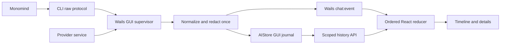

# Interactive Agent Chat Implementation Plan

> **For agentic workers:** Use the `mastermind-execute` skill to implement this plan task-by-task. Steps use checkbox syntax for tracking.

**Goal:** Make chat communicate what the agent is doing, expose useful tool details, preserve work across interruptions, and make results directly usable.

**Architecture:** Wails supervises GUI turns and owns their normalization, sequencing, journal, and terminal state for both backends. The CLI retains its existing raw protocol and external Monomind delegation; the provider service retains its model-context transcript, isolated by app conversation. One React reducer renders the live and historical GUI event stream.

**Tech Stack:** Existing Go CLI, SQLite AI store, Wails bridge, React 19, Vitest, Testing Library, Lucide, react-markdown and remark-gfm.

**Status:** Finalized after a second source review and independent backend review on September 11, 2026. Ready for phased implementation; application code has not been changed. This is the authoritative product/architecture plan with concrete contracts and release gates, not a prewritten implementation patch. Estimates assume the current working tree, including unrelated changes, is preserved.

## Global constraints

- Preserve the external Monomind architecture; do not implement agent CLI parsers in the GUI.
- Preserve user-selected runtime, model, resumable sessions and tool permissions. Target the mounted global chat first; retain the component's workflow-context API for future callers without adding a workflow editor.
- Present observed activity and deliberately published progress summaries. Do not invent hidden reasoning, percentage completion, command output, or successful results.
- Keep the system local-first. No new telemetry or hosted chat dependency.
- Never enable tools or run permissions implicitly as part of this redesign.
- Scope new history and events by profile, conversation, and turn. Runtime session IDs are separate from app conversation IDs.
- Build on the current working tree without overwriting unrelated changes.

## 1. Findings from the current implementation

| Area | Observed implementation | Consequence |
|---|---|---|
| Chat layout | `wails-app/frontend/src/components/AIChatPanel.jsx` has a fixed 380px panel, small monospaced text, inline styling | Long responses, code, and tool outputs are difficult to read |
| Message rendering | `MessageBubble` prints plain text | Markdown headings, tables, links and code have no semantic presentation |
| Waiting | A generic `Thinking...` appears before content/tools | Users cannot distinguish startup, model response, or tool execution |
| Tool lifecycle | GUI appends every `ai:tool` event to an array | Start/result events become separate cards instead of one changing step |
| Tool result transport | `app_ai.go` reads `ev.Text`; protocol uses `result.text`; call-start emission omits a dedicated call ID | Results can be empty and reliable pairing is impossible in the current UI |
| Structured events | Protocol includes start, session, assistant, tool call/result, usage, result, error, done | GUI ignores start, usage and result details |
| Error handling | Frontend clears partial output for every error, without consulting `fatal` | Recoverable warnings look terminal; completed work disappears |
| Terminal state | Bridge sends a clean done chunk after EOF; exit failures/missing done are logged separately | Conversation may appear complete after a failed subprocess |
| Stop | Frontend sets streaming false; partial content is only shown while streaming | Stopping can hide unfinished work before it is committed |
| Tool-only turns | Finalization returns early when there is no assistant text | Tool activity may never become a persisted visible message |
| Ordering | Text is accumulated separately from tools and tools render below text | The actual sequence of commentary, actions, and results is lost |
| History | CLI saves user/final text after success; frontend drops `role=tool` rows when loading | Agent activity and failed/cancelled partial turns are not faithfully replayable |
| Session refresh | Session list is refreshed after `StreamAgentChat` acknowledges launch, not turn completion | Newly persisted sessions may not appear at the intended time |
| Scrolling | Smooth scroll runs on every content/tool change | Reading earlier messages fights the live stream |
| Provider backend | Tool callback runs after execution; continuations use non-streaming `Complete` | This path cannot currently show a true tool-start event or token-streamed continuation |
| Profile isolation | `ai_chat_messages` queries use workflow/session IDs, without a profile column | Shared IDs such as `general` need an explicit isolation audit before new history is layered on |

**Adaptability correction:** `App.jsx` currently mounts only the global `AIChatPanel` with `workflowID="general"` and `canvasMode={false}`. Its route map has no workflow editor or execution detail page. Comments and the unused `onWorkflowCreated` prop are not evidence of reachable navigation. The first release must not promise Open canvas or execution-detail actions.

Additional documentation drift: supplied AGENTS instructions describe GUI tools as off by default, but `frontend/src/lib/assistantTools.js` currently defaults both tools and runs on unless explicitly disabled. Resolve the policy separately; this project should display the effective permissions accurately without silently changing them.

Evidence inspected: `AIChatPanel.jsx`; `services/api.js`; `app_ai.go`; `internal/monomind/types.go` and event fixtures; `cmd/monoagentcli/chat.go`; `internal/ai/chat/service.go`; `internal/ai/store.go`; frontend package dependencies and existing render-test patterns. Monograph reported no index; memory search returned nothing relevant. No live GUI walkthrough or runtime parity test was performed, so visual judgments are source-based and provider support remains to be verified.

## 2. Recommended experience

Make the default chat readable and calm, with detailed execution information one click away.

```text
Assistant                Claude · selected model     [Expand]
General conversation                      Tools on · Runs off
─────────────────────────────────────────────────────────────
You   Add validation before saving the invoice.

Assistant   I’ll inspect the workflow and check its fields.

  ✓ Inspect workflow                         0.4s    [Details]
  ✓ Read node schema                         0.2s    [Details]
  ● Update validation node                   2.1s    [Details]

  Working · 3 tool calls · 5s elapsed                 [Stop]

  [Workflow: Invoice intake]                       [Copy ID]

Assistant   Added validation for the required invoice fields.

  Completed · 8s · 3 tools                  [View activity]
─────────────────────────────────────────────────────────────
[Message the assistant…                                  ]
[Context]                                      [Send]
```

The durations and operations above are illustrative, not measurements or claims about a real run.

### Conversation and activity

- Render assistant prose with Markdown. Use the app's normal readable text face at approximately 14px; reserve monospace for commands, IDs, and structured data.
- Interleave text blocks and tool steps in their actual order. A tool result updates its existing step, rather than adding a second card.
- Running tools stay visible. Successful steps may collapse when the turn finishes, but errors remain prominent. Never collapse a card the user is actively inspecting.
- Each step has a human-readable verb, exact tool name in details, status icon plus text, elapsed time, arguments, output, and a copy control.
- Empty string, zero, false and null are valid results. Distinguish them from a result that has not arrived.
- Multiple in-flight calls show independently. Do not reduce them to one misleading current-tool label.
- Offer an optional Activity view with timestamps and redacted event details. This is an execution log, not an interactive shell.

### Honest progress

Use `Starting agent`, `Waiting for response`, `Running <tool>`, `Responding`, `Stopping`, `Completed`, `Failed`, and `Stopped` based on actual events. After 15 seconds without activity, show `No new activity for 15s`; silence is not proof of a hang.

Show high-level reasoning/progress summaries only if the runtime explicitly supplies a public summary. The current protocol has no such event. Do not relabel ordinary assistant output as private thinking or generate simulated thought text to fill gaps.

Show token usage and cost only when reported and semantically understood. Missing cost means unavailable, not $0. Do not sum cumulative usage events as if they were per-step increments. A spinner and elapsed time are appropriate when there is no denominator for a progress bar.

### Layout and interaction

- Keep the existing docked panel, make it resizable (proposed 380–720px, constrained by viewport), and add an expanded workspace view with a roughly 760px reading column.
- Below 640px, use a full-width overlay and a details drawer instead of side-by-side panes. Preserve the current transcript and draft when switching presentation.
- Auto-follow only while the reader is within 80px of the bottom. Otherwise show `Jump to latest` with an unread activity indicator.
- Keep Stop available throughout a turn; show `Stopping` until backend acknowledgement. Preserve partial content and mark unfinished tools interrupted.
- Retain an editable draft while the agent works. For the first release, Send stays disabled until termination; queueing and mid-run steering are later capabilities.
- Retry prepares the previous prompt for a new turn. Never silently repeat a side-effecting tool call.
- New chat and runtime/model changes preserve existing session compatibility behavior. Refresh history on terminal persistence acknowledgement.
- In the mounted global chat, show created workflow metadata and Copy ID. Do not add a dead Open canvas action. Preserve the optional workflow callback contract for future integrations. Existing organization watcher navigation remains unchanged in this release; chat cards are not its only navigation trigger.

### Useful results

Start with a workflow metadata/Copy ID card. Add Open organization through `App.jsx`'s `pendingOrgSelect` plus `navigate("orgs")`, and View document only for a backend-resolved `vault_documents` record. `FileViewerModal({doc,onClose})` expects that record, not an arbitrary file path. Execution results stay inspectable as tool output until a real detail destination exists.

Cards derive from validated tool outputs and confirmed entity IDs. Never convert arbitrary model text into an executable action. File viewing must use existing authorized backend APIs; a path mentioned in prose is not authority to open it. Do not auto-fetch remote Markdown images. Web links require normal user activation and scheme validation.

Later, show workflow changes with before/after data only when both snapshots are actually available. An after-the-fact tool card is not an approval request.

## 3. Capability boundary

| Capability | Readiness | Required work |
|---|---|---|
| Readable Markdown, copy, resize, scroll control | Existing frontend dependencies | UI work |
| Tool start/result pairing and statuses | Existing agent protocol | Bridge normalization and reducer |
| Usage and completion reasons | Existing protocol fields, some absence information lost | Preserve optional metric presence and terminal semantics; derive duration locally |
| Recoverable errors and interrupted work | Existing error/cancel concepts | Lifecycle handling and persistence |
| Provider tool-start events | Not exposed by current callback | Extend internal provider service callback |
| Durable activity replay | Not stored today | Add turn/event storage and history API |
| Workflow result cards | Tool result exists; no editor route | Validated metadata and Copy ID; no canvas navigation |
| Public reasoning summaries | No event in current Go protocol | Monomind extension and capability negotiation |
| Streaming stdout/stderr | No dedicated current event | Monomind extension; bounded/redacted output chunks |
| Plan steps and sub-agent tree | No dedicated current event | Stable step/agent IDs and parent relationships upstream |
| In-chat approval/question controls | Not established by this stream | Backend request/reply protocol; do not infer from text |
| Mid-run steering | Not established | Runtime input protocol and acknowledgement |

## 4. Final architecture and ownership

### Fit to existing modules

- `internal/monomind/`: keep the external runtime protocol and process execution here. Correct existing termination/optional-metric handling here; no new reasoning or terminal-output protocol in this release.
- `internal/ai/chatevents/` (new): pure event types, normalization and display redaction; no Wails imports, database connection or dependency on the parent `ai` package. `ai` may import this leaf package without a cycle.
- `internal/ai/chat_events.go` (new): journal tables and scoped store methods, using `AIStore.initTables()`. Do not introduce a competing numbered migration for the same tables.
- `wails-app/app_chat.go` (new): the sole GUI supervisor. Own admission, per-turn registry, event sequence, write/emit ordering, process callback lifecycle, and finalization. `app_ai.go` remains provider administration and compatibility bindings.
- `internal/ai/chat/service.go`: retain provider execution and model messages. Pass immutable turn options and lifecycle callbacks; do not mutate the shared CanvasTools profile during a running turn.
- `AIChatPanel.jsx`: retain panel mounting and runtime-selection orchestration; extract the reducer, stream hook, timeline, tool card, composer, and scoped CSS beneath `components/chat/`. No state framework, new router, AI SDK, or terminal emulator is needed.



The supervisor owns every GUI journal write, including startup failure and cancellation. CLI execution never writes this journal. This removes the previous plan's dual-writer sequencing and hard-kill persistence contradiction.

For GUI calls add `chat --no-history`, which suppresses legacy transcript writes even with `--canvas`; it must not suppress profile initialization, tools, or runtime session events. Ordinary CLI invocations retain their existing transcript behavior and raw event contract. The GUI uses the new journal as its history source, so it must not also import its own legacy CLI transcript. This flag needs a bundled CLI/GUI release and a clear launch error if an older selected CLI rejects it; never silently launch a second turn as fallback.

### Conversation and model context

Use three distinct identifiers:

1. Server-created app conversation ID: persisted before its first turn, scoped to the active profile, with immutable backend kind and workflow context (`general`, `draft`, or an owned workflow ID).
2. Client-created turn ID: registered locally before Start, unique under that conversation. Duplicate Start with the same ID returns existing admission/status, never starts a second process.
3. Runtime session ID: bound by a runtime event and used only for Monomind `--resume`; absent sessions do not prevent a conversation appearing in history.

For provider conversations, generate an opaque `historyKey` on the backend and use it as the existing `ai_chat_messages.workflow_id` storage bucket. Separate `workflowID` (tool context/ownership) from `historyKey` (model context) in provider options. Every lookup first checks the conversation's active-profile ownership; callers cannot supply arbitrary history keys. Thus New chat creates fresh provider context without a broad rewrite of existing message storage. Preserve complete assistant-tool/result groups when enforcing the 40-message context window; never start context with an orphan tool result.

For agent conversations, backend kind/runtime changes create a new app conversation and clear resume. Model changes also start a new conversation in v1 for predictable compatibility. Resuming an existing conversation takes its stored runtime/model/session binding; a new Agents-page runtime selection must not relabel an old transcript. Permission settings are read for every turn and must remain effective when resuming; verify runtime enforcement with a fixture/smoke check and start fresh if the runtime cannot narrow permissions on resume.

### Proposed Wails bindings

These are new contracts, not current methods. Keep existing bindings while migrating, but the new UI consumes only `chat:event`.

```go
CreateChatConversation(backend, workflowID, runtimeID, providerID, model string) string
StartChatTurn(conversationID, turnID, message string, tools, allowRuns bool) string
StopChatTurn(conversationID, turnID string) string
ListChatConversations(cursor string, limit int) string
GetChatTurns(conversationID, cursor string, limit int) string
GetChatEvents(conversationID, turnID string, afterSeq int64, limit int) string
DeleteChatConversation(conversationID string) string
```

Responses follow the current JSON-string Wails convention: `{error}` on failure, otherwise typed JSON payloads. Start returns `{ok,turnId,status}` as admission only. History returns `{items,nextCursor}` or `{items,nextSeq,hasMore,lastCommittedSeq,historySaved}`. Backend derives profile and validates all IDs; limit is clamped to 1–200. `tools/allowRuns` apply to agent mode; provider mode exposes its existing canvas-tool capability honestly rather than claiming those toggles govern it. No new permissions policy is introduced here.

### Event contract

```json
{
  "version": 1,
  "profileId": "default",
  "conversationId": "conversation-uuid",
  "turnId": "turn-uuid",
  "seq": 7,
  "at": "2026-09-11T09:00:00.000Z",
  "type": "tool.completed",
  "payload": {"callId":"tc_1","name":"get_workflow","ok":true,"result":{"text":"result"}}
}
```

| Event | Required payload and behavior |
|---|---|
| `turn.started` | Backend/runtime/model, accepted user text; sequence 1 before launch |
| `session.bound` | Runtime and session ID; update conversation binding |
| `assistant.delta` | Text and locally assigned text-part ID; adjacent text joins, a tool-start opens a new boundary |
| `tool.started` | Call ID, name, structured arguments; append one timeline step |
| `tool.completed` | Call ID, nullable success, present result; update matching step; retain unmatched results |
| `usage.updated` | Nullable input/output tokens and USD cost; source event type; latest cumulative snapshot, never sum without verified delta semantics |
| `notice` | Code, message, severity; nonfatal errors do not erase work |
| `turn.finished` | Status, reason, optional exit code and `historySaved`; exactly once after supervisor completion |

Tool identity is `(turnId,callId)`, never array position or name. False, zero, null and empty text are valid outputs. Preserve reported metric presence through CLI decoding/serialization with custom optional handling in `monomind.Event` and fixture tests; do not break existing Go consumers merely by changing every scalar to a pointer. If an upstream adapter omits a metric, show unavailable. Duration is local elapsed time, not a runtime-provided tool-duration claim.

Assistant frames are rendered according to the verified protocol's text semantics. Result text is a fallback only when no assistant text was received; never append an entire final answer again. If an adapter emits snapshots instead of deltas, normalize in Monomind, not heuristically in React.

### Lifecycle, cancellation and profiles

Admission snapshots the active profile, validates conversation ownership, registers the turn and acquires one active-turn slot per conversation across both backends. Starting another ID while busy returns `busy`; UI retries are not implicit supersession. Existing legacy supersession behavior can remain behind old bindings while migration is tested.

Stop targets the exact conversation/turn and sets stop-requested under the registry lock. It is idempotent, cannot kill a newer turn, and does not delete the handle before its reader is drained and process reaped. A completed turn stays completed if Stop arrives afterward. On Unix preserve group cancellation; on Windows the current helper kills only the direct child, so do not claim equivalent process-tree guarantees without implementing and testing them.

The supervisor finalizes after `cmd.Wait`/provider return, using this precedence:

1. A Stop accepted before finalization gives `cancelled` and keeps already-observed errors as notices.
2. Fatal error, result `is_error`, nonzero protocol/process exit or scan failure gives `failed`.
3. Missing terminal protocol evidence on otherwise clean EOF gives `interrupted`.
4. Valid terminal evidence with no failure gives `completed`, preserving stop reason. `max_turns`/`tool_round_cap` are displayed as limit reached, never a normal task-success claim.

Inspect/fix the same existing error semantics in `internal/monomind/exec.go` so CLI exit behavior agrees with GUI fixtures. Replace `os.Exit` inside chat `RunE` with the repository's mapped error path so cleanup runs. Provider execution must retain `(result,error)` instead of inferring failure from JSON text; check context before tools and continuations. A synchronous tool already executing can finish before Stop takes effect: display Stopping until it returns and preserve its actual result. Stop does not roll back side effects.

Use per-turn CanvasTools with a captured profile and the current registered node types. `SwitchProfile` currently reloads only the frontend, not Wails: existing running turns must remain owned by their original profile and continue journaling there. Returning to that profile reattaches and exposes Stop. Do not mark active turns interrupted on a WebView reload. App shutdown cancels its registered turns; only records owned by a previous dead app instance are reconciled as interrupted at backend startup. Never update another live instance's turns merely because they share the database.

### Storage, replay, legacy compatibility

Create three tables through the AI store initializer:

- `ai_chat_conversations`: ID, profile, backend, workflow context, runtime/provider/model, optional session binding, opaque provider history key, timestamps. Mutable metadata; unique ID and scoped list index.
- `ai_chat_turns`: ID, conversation/profile, owner app-instance ID, accepted prompt, status/reason, timestamps, last committed sequence. Mutable projection.
- `ai_chat_events`: conversation/profile/turn, sequence, timestamp, version, type, JSON payload. Append-only until explicit conversation deletion; unique `(profile_id,conversation_id,turn_id,seq)`.

Store accepted input before launching work; reject admission if that write fails. Serialize writes per turn. Coalesce adjacent text for at most 50ms/16KB before allocating sequence, then commit before emitting the identical event. Tool/session/terminal boundaries flush pending text. Update terminal projection and insert terminal event in one transaction with a compare-and-set from active status.

If persistence fails mid-turn, retain the live transcript, set `historySaved:false`, and show History could not be saved. Stop advancing durable high-water state; keep subsequent events live-only for that turn. Do not claim crash recovery for uncommitted events. A crash may lose the final coalescing window or unread subprocess output; previously committed events must survive. No remote storage or general event bus is required.

Subscribe before history fetch. Buffer live events during initial hydration, merge by sequence and deduplicate, then apply in ascending order. A high live sequence must not cause older fetched events to be discarded. Fetch missing gaps; never infer sequence continuity from the highest event seen. Page turns newest-first, events ascending. Guard asynchronous loads with a conversation generation token so a slow old fetch cannot replace the newly selected transcript.

When `historySaved:false`, `lastCommittedSeq` is the durable catch-up ceiling: never repeatedly fetch deliberately live-only gaps above it. A reload restores the committed prefix and current supervisor status, with an explicit unavailable-activity notice for a lost live tail. Turn-list responses include owner/active status; another live app instance's turn is read-only here and must be stopped in its owning instance. These rules prevent replay from pretending to recover information that was never stored.

Legacy APIs must also gain ownership checks: `ListChatSessions`, `GetChatSessionMessages`, `GetAIChatHistory`, `ClearAIChatHistory`. New provider prompts never read `general` or legacy workflow-wide context. Legacy rows with a provable owned workflow may be offered read-only in a separate Legacy history section with stable `(created_at,rowid)` ordering and tool-result pairing. Ambiguous general/draft rows remain untouched on disk but are excluded from profile lists and model context; do not silently assign them to whichever profile opens first. Legacy resume can be added later through an explicit verified conversion, not automatic merging.

Delete conversation is blocked while a turn is active. After existing delete confirmation, transactionally remove its events/turns/metadata and its provider history-key rows. New chat preserves old conversations. Local deletion does not delete a provider's external resumable session; label it Delete local conversation and reset the binding.

### Bounded output and redaction

Reuse `workflow.RedactItems` for parsed arguments/results and JSON embedded in result text. It masks credential-shaped keys; it does not recognize arbitrary secrets in prose. Document this limit rather than claiming universal secret removal. Do not retrieve secret values to construct a redaction list.

New journal, event details and copy controls use the same sanitized display projection. Initial limits: tool argument/result preview 16KB each; serialized event 64KB; UI hides most details until expanded. Split large assistant text into bounded ordered events. Oversized tool content is represented by a UTF-8-safe prefix, original byte count and `truncated:true`; Copy copies the retained preview. No full-output retrieval service is promised in v1. Entity cards may separately open an already-supported authorized document. This deliberately removes the previous plan's unimplemented large-blob subsystem.

Do not put raw args/results in debug logs or mirrored legacy events. Redaction is for the new display/journal boundary; existing provider model-context persistence remains a separate operational store and is not falsely described as universally sanitized.

## 5. Implementation sequence and verification

Paths beginning `chat/` below are relative to `wails-app/frontend/src/components/`. New helpers belong in the named files, not a wholesale rewrite of unrelated modules. Each task is independently reviewable; implement its listed regression cases before switching production consumers.

### Task 1 — Contracts, scoped conversations and store

**Create:** `internal/ai/chatevents/event.go`, `event_test.go`, `internal/ai/chat_events.go`, `chat_events_test.go`.
**Modify:** `internal/ai/store.go`, `store_test.go`, `wails-app/app_ai.go` legacy history checks.

- [ ] Implement the event contracts, nullable metric representation and schema above; initializer propagates real migration errors instead of ignoring all errors.
- [ ] Implement scoped create/list/read/append/finalize/delete methods; transactional unique sequence and terminal compare-and-set.
- [ ] Add opaque provider history-key mapping and legacy ownership restrictions.
- [ ] Test two profiles with general chat, duplicate IDs, duplicate terminal, equal timestamps, missing-session conversations, delete rollback, legacy ambiguous exclusion and schema reinitialization.

**Gate:** `go test ./internal/ai/...`; a reopened temporary database returns exactly the committed event sequence. No live user database is used in tests.

### Task 2 — GUI supervisor and backend adaptation

**Create:** `wails-app/app_chat.go`, `app_chat_test.go`, `internal/ai/chatevents/normalize.go`, `normalize_test.go`.
**Modify:** `wails-app/app.go`, `app_ai.go`, `internal/ai/chat/service.go`, `service_test.go`, `internal/monomind/types.go`, `exec.go`, `exec_test.go`, `cmd/monoagentcli/chat.go`, `chat_test.go`.

- [ ] Implement proposed bindings, injectable event emitter/process launcher, exact-turn registry, durable admission, finish-once and write-before-emit pipeline.
- [ ] Add GUI `--no-history`, test explicit history and canvas fallback suppression, retain ordinary CLI output/history semantics.
- [ ] Correct scanner/result/done error propagation and optional metrics end to end; test success after a nonfatal warning, result-only text, explicit zero versus omitted cost and nonzero done with a zero process exit.
- [ ] Extend provider turn options with profile, workflow context and history key; instantiate per-turn tools with copied node registry, preserve typed tool error, emit starts before execution, and terminate only after the whole loop.
- [ ] Add context checks and explicit round-cap outcome; keep provider continuation batching accurately represented instead of simulating token streaming.
- [ ] Test start failure, duplicate Start, Stop before output, Stop after completion, stale Stop, profile switch during delayed tool, forced process failure, WebView reload, backend restart, persistence failure and two app owners.

**Gate:** focused root tests plus `go test ./...` from `wails-app/`; race tests for the new store/supervisor where supported. Fake runtimes only; no real tool side effects.

### Task 3 — Stream reducer and history integration

**Create:** `chat/chatReducer.js`, `chatReducer.test.js`, `chat/useChatStream.js`, `chat/useChatStream.test.jsx`.
**Modify:** `AIChatPanel.jsx`, `services/api.js`, `services/api.test.js`, generated Wails bindings.

- [ ] Add API wrappers using existing `parseStreamResult`/`subscribeEvent` conventions. Dispose only the current subscription, never all listeners for an event name.
- [ ] Move live state into a pure reducer with ordered parts, call lookup, notices, terminal state and scope; remove nested React setter side effects.
- [ ] Add conversation creation/listing, provider New chat, runtime/session binding, hydration merge, gap catch-up, stale-request guards and post-terminal refresh.
- [ ] Batch visual updates per animation frame with a timer fallback while hidden; flush at boundaries. Hidden panel must not lose journal events or queue unbounded text.
- [ ] Test interleaving, same-name parallel tools, orphan/empty result, tool-only response, duplicate events, fetched older events after live newer events, stale history responses, warning recovery and stopped partial output.

**Gate:** frontend unit/hook tests and build pass; two subscribers remain independent. New UI uses only the new event stream. Regenerate bindings with the project's Wails build workflow; never edit only the `.d.ts` declaration.

### Task 4 — Timeline, details and readable output

**Create:** `chat/ChatTimeline.jsx`, `chat/ToolActivityCard.jsx`, `chat/TurnStatus.jsx`, `chat/ChatMarkdown.jsx`, `chat/chat.css`, `chat/ChatTimeline.render.test.jsx`.
**Modify:** `AIChatPanel.jsx`.

- [ ] Render Markdown using installed react-markdown/remark-gfm; raw HTML stays text, remote images do not auto-load, links allow only approved schemes through existing openURL behavior.
- [ ] Render one accessible expandable card per call, typed status, meaningful title, elapsed time and bounded input/output copy.
- [ ] Implement truthful progress/idle status, final reason, optional usage and Activity details from the same reducer state.
- [ ] Add keyboard/focus, truncation, huge code line, malformed Markdown, empty output and nonfatal-error tests. Render tests declare the jsdom environment, matching existing repository patterns.

**Gate:** a deterministic fixture can be followed from user request to final result without losing ordering, errors or partial work.

### Task 5 — Responsive panel and composer

**Create:** `chat/ChatComposer.jsx`, `chat/useChatScroll.js`, `chat/ChatInteraction.render.test.jsx`.
**Modify:** `AIChatPanel.jsx`, `chat/chat.css`, `App.jsx` only for expanded presentation if required.

- [ ] Preserve lazy runtime scans, first-open fetching, keep-alive mounting and cached runtime discovery.
- [ ] Add width clamping, expand mode, narrow overlay, focus return and Escape behavior without remounting the turn owner.
- [ ] Add 80px follow threshold, Jump to latest, draft persistence, IME-safe Enter, reduced motion and Stop feedback.
- [ ] Test resizing while streaming, reading older messages, close/reopen, navigation, async session selection and new-conversation behavior.

**Gate:** the reader's position and draft survive activity and layout changes. Stop remains available until actual termination.

### Task 6 — Result actions that exist today

**Create:** `chat/chatArtifacts.js`, `chat/chatArtifacts.test.js`, `chat/ChatArtifactCard.jsx`.
**Modify:** `AIChatPanel.jsx`, `App.jsx`; `app_documents.go` only if scoped document metadata lookup is missing.

- [ ] Allowlist known tool/result adapters: workflow metadata/Copy ID; organization name validated through existing org listing and opened using pending selection; vault document ID resolved to trusted metadata before FileViewerModal.
- [ ] Pass a small `onOpenArtifact` callback from App; do not introduce a router or extract navigation state from hidden pages.
- [ ] Test missing/deleted/cross-profile entities, forged paths, malformed IDs and unsupported results. Keep generic tool output as fallback.
- [ ] Leave org watcher navigation semantics unchanged; do not pretend the result card prevents watcher-triggered navigation.

**Gate:** actions activate only on user clicks and resolve through scoped backend lookups. No workflow/editor or execution route is invented.

## 6. Release scope and validation

**First integrated demo:** Tasks 1–4. Real activity, accurate lifecycle, readable Markdown and replay all use the final contract from the beginning. Tasks 5–6 complete the first release.

**Planning estimate:** 15–22 engineering days for tasks 1–6 plus review/desktop QA; higher uncertainty is in provider context separation, legacy history and runtime fixtures. This supersedes the earlier 12–18 day estimate. It is not a schedule commitment or justification to skip gates.

Final checks from the repository root:

```sh
go test ./internal/ai/... ./internal/monomind/... ./cmd/monoagentcli/...
go vet ./internal/ai/... ./internal/monomind/... ./cmd/monoagentcli/...
```

From `wails-app/`: `go test ./...` and `go vet ./...`. From `wails-app/frontend/`: `npm test` and `npm run build`. For the integrated desktop/binding check use the root Makefile's `make build`, which builds both CLI and Wails app and accounts for Linux WebKit tags. Record platform/toolchain blockers explicitly rather than declaring skipped checks passed.

Fixture matrix: both backends, absent runtime, no session event, multi-step tools, same-name parallel tools, warning recovery, result error, nonzero protocol exit, round cap, Stop, direct-process crash, giant result/frame, restart and missed-event catch-up, permission changes on resume, profile switch, duplicate send, delete while active, new provider conversation and 40-message context boundary.

Desktop checks: global panel on first open, page navigation, dark theme readability, dock/expanded/narrow layouts, keyboard-only details, IME composer, scroll-up during stream, reduced motion, file and org results. Do not claim native Windows descendant cancellation without platform evidence. Real runtime read-only smoke tests supplement fixtures; mock events alone do not establish provider parity.

Performance targets, not measurements: event receipt to visible update under 100ms p95 on a recorded reference desktop; responsive interaction with 1,000 steps and a 200-event/second burst. Test bounded memory/queue behavior and 50ms long tasks. Coalesce text, page history and mount details on demand first; add virtualization only if profiling warrants it.

Accessibility: announce meaningful state changes in a polite status region, not every token. Use status text plus icons, semantic buttons with `aria-expanded`, visible focus and reduced motion. [W3C ARIA22](https://www.w3.org/WAI/WCAG21/Techniques/aria/ARIA22) describes the status-region pattern.

## 7. Explicit follow-up scope

Public reasoning summaries, plan-step updates, sub-agent progress, live stdout/stderr, mid-run steering and inline approval/question controls require verified Monomind producer events and, where interactive, a request/reply contract. They are not part of the first-release estimate. Define each in the external runtime repository with capability negotiation and old-runtime fixtures before modifying this GUI. Ordinary current-protocol chat must remain usable.

Also excluded: workflow editor restoration, execution-detail routes, universal secret detection, raw output blob storage/retrieval, provider model migration, automatic retries of side effects, editing/resending individual tools, and deletion of external runtime sessions.

A supported-protocol parity fixture feeds equivalent events through CLI and GUI. Each tool ID/status, reported metric, final reason and retained output preview must remain inspectable once, in order, with truncation and unavailable fields explicit.

## 8. Review resolution and final assessment

| Review finding | Final decision |
|---|---|
| CLI-only journal cannot survive GUI hard kill or launch failure | Wails owns all GUI admission, journal and terminal events |
| Normalization/write owners disagreed | One normalizer and sequence allocator before journal and bridge |
| Workflow/editor action absent from current route map | Metadata/Copy ID; real org and document destinations only |
| Mutable provider profile can drift mid-turn | Immutable per-turn profile/tool instance and exact-turn registry |
| New journal alone cannot isolate old model context | Backend-generated provider history key; gate all legacy history APIs |
| App conversation has no durable identity independent of runtime | Add explicit conversation table and binding rules |
| Provider tool errors are converted to JSON strings | Preserve typed error before producing display event |
| Monomind terminal faults were deferred as new protocol work | Correct existing executor semantics in Task 2 |
| Missing and zero usage collapse in typed serialization | Preserve optional presence end to end; unavailable when upstream omits |
| Crash persistence and reattachment were overclaimed | Commit-before-emit, explicit buffer-loss window and owner-aware restart handling |
| Full-result retrieval had no implementation | Bounded preview with truncation; separate existing entity viewer only |
| Live history merge could discard earlier events | Buffer/merge/sort/deduplicate with gap catch-up |

**Final assessment:** the timeline/reducer direction fits the current React/Wails/Go structure. Implementation can proceed without replacing the runtime or introducing a UI framework. Foundational lifecycle and history changes must ship with the visual work, and upstream-only capabilities remain separate. All identified plan-level contradictions above are resolved; live adapter semantics, desktop appearance and platform cancellation remain explicit implementation verification gates.

Reference inspiration: AI Elements' [activity component](https://elements.ai-sdk.dev/components/chain-of-thought) and [chat example](https://elements.ai-sdk.dev/examples/chatbot) illustrate expandable activity. They are interaction references, not a dependency recommendation or evidence that our runtime exposes internal reasoning.
