# Org walkthrough (Phase 5, Unified Org UI)

This walkthrough follows one org, `content-team`, through the Org page of the
desktop GUI. It is the manual walkthrough the Phase 5 gate asks for in
[the org/workflow unification plan](../../plans/2026-09-15-org-workflow-unification.md)
(§10). Every screen was taken from the real GUI, running against a real
`monoagentcli` in a separate home folder. The steps below explain how to take
them again.

## The screens

### 1. Org list with Needs you badges

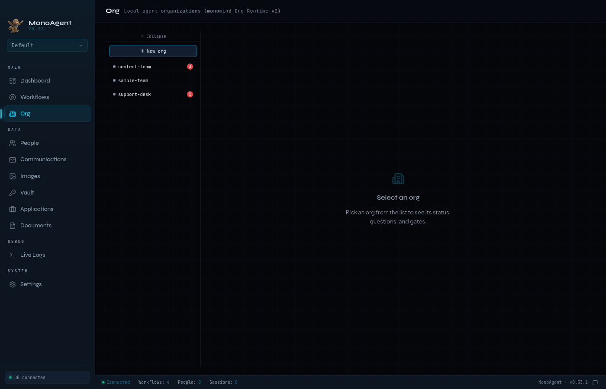

The Org page lists every org in the active profile. The red number next to an
org is how many items are waiting for you in it (Needs you). The list polls it
on every tab, so you can see waiting work without opening the org.

### 2. Design tab with an automation role

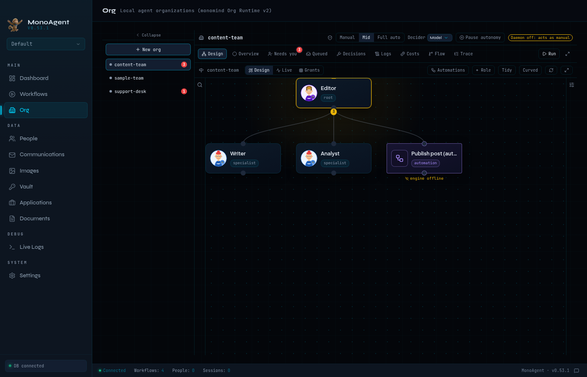

The Design tab shows the org chart. **Publish post** is an automation role: a
workflow that sits in the chart like an agent. When the editor messages it,
the workflow runs. Its card reads "engine offline" because `monoagentcli
daemon` was not running for these screenshots.

### 3. Automations drawer

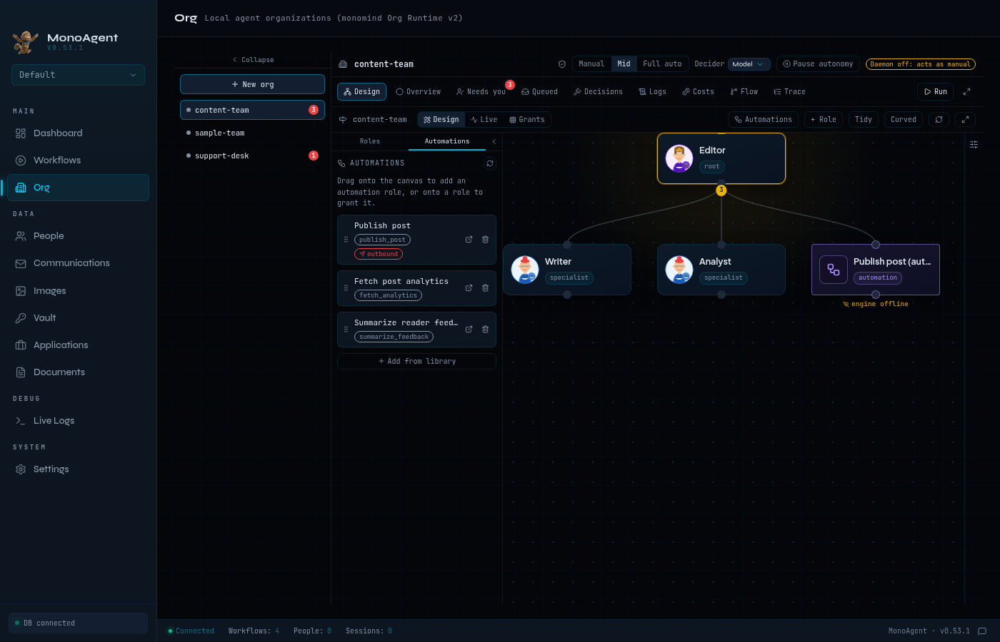

The Automations tab of the left drawer lists the workflows that belong to the
org. If a workflow sends anything outside mono-agent (here, Slack), it is
marked **outbound**. Drag an automation onto empty canvas to make it an
automation role, or onto a role to grant it. **Add from library** adds another
workflow from the profile.

### 4. Granting an automation to a role

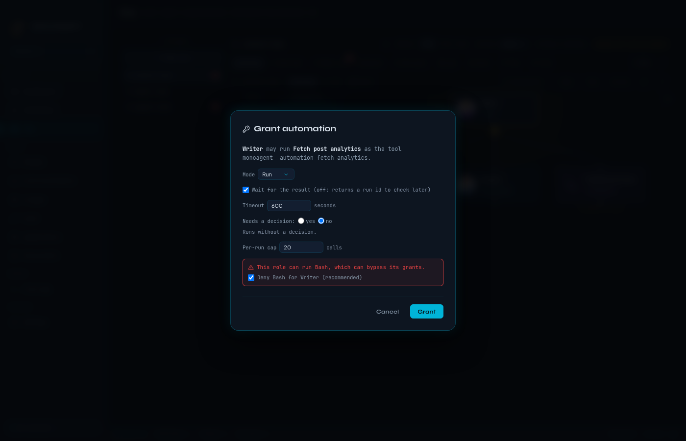

Dropping **Fetch post analytics** on the Writer card opens this dialog. You
choose the mode, whether the role waits for the result, whether each call
needs a decision, and the per-run cap. The role has Bash, which could bypass
its grants, so the dialog offers to deny Bash for it. **Grant** saves it
through `monoagentcli org grant add`.

### 5. Grants matrix

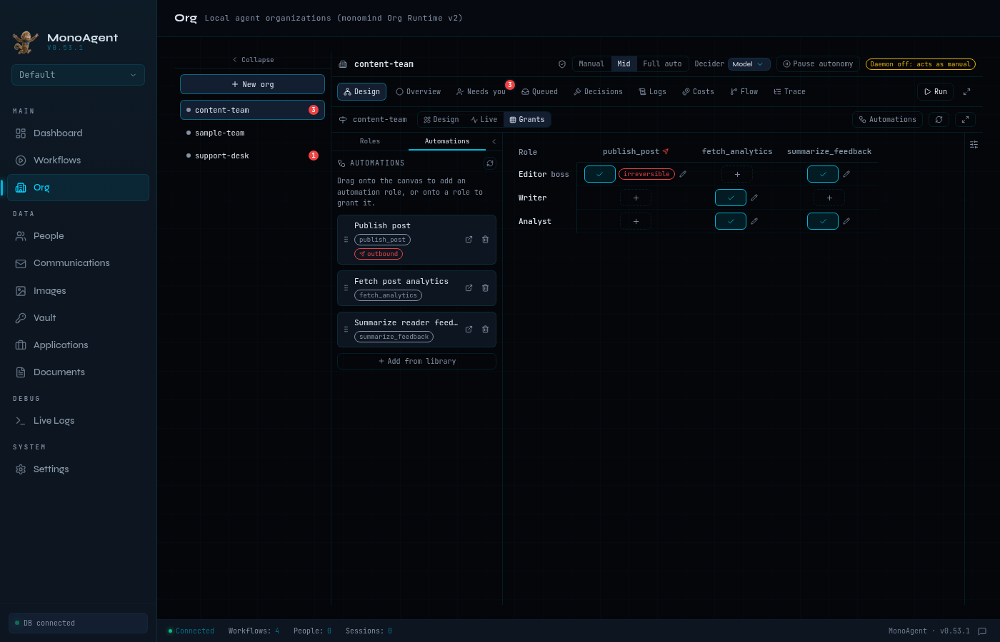

The Grants view shows every role against every automation. Click a cell to
grant or revoke, or click the pencil to edit a grant. Editor's grant of
**publish_post** is marked irreversible because that workflow posts to Slack.

### 6. A role's effective tools

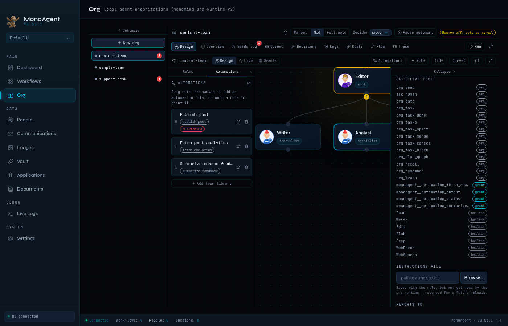

Select a role and its inspector lists the tools its model will see: the org
tools, the automations granted to it (`grant`), and the runtime's own tools
(`builtin`). This is the output of `monoagentcli org effective-tools`.

### 7. Needs you

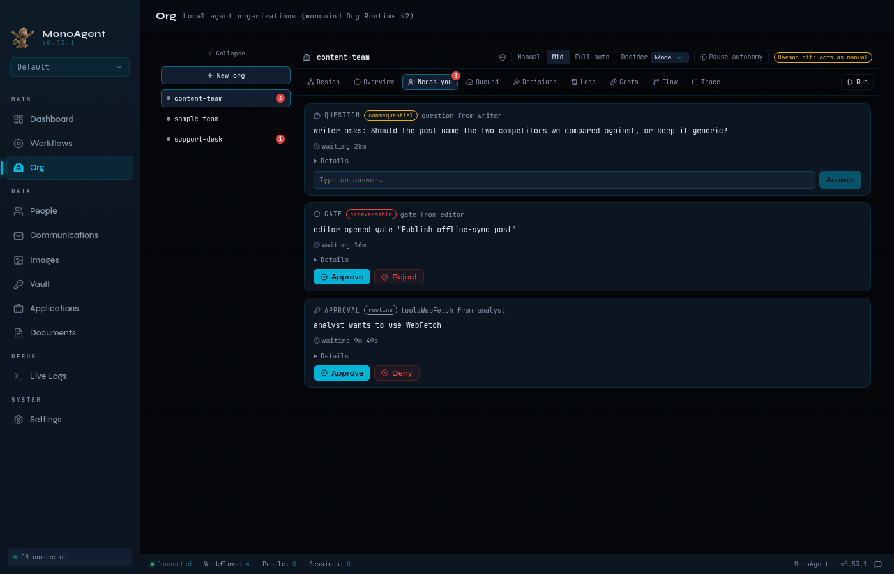

Needs you lists what is waiting for a person: a question, a gate, and a tool
approval, each with its tier and how long it has waited. You answer, approve,
or reject right here. Nothing on this tab is resolved without a click. The
header shows the autonomy controls: the level (Manual, Mid, Full auto), the
decider (Model, Boss, Parent) and Pause autonomy.

### 8. Full auto confirmation

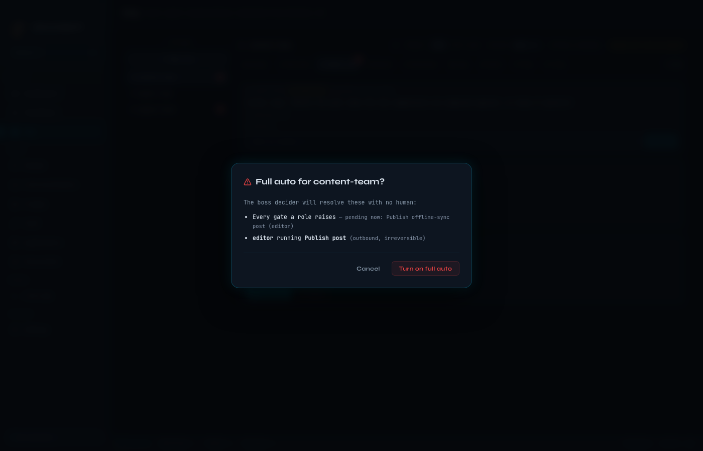

The decider was switched to **Boss** in the header, and then **Full auto** was
clicked. Before the level changes, this dialog lists what the decider will
then resolve with no person involved: every gate (including the one pending
now) and every grant to an outbound, irreversible workflow.

### 9. Decisions feed

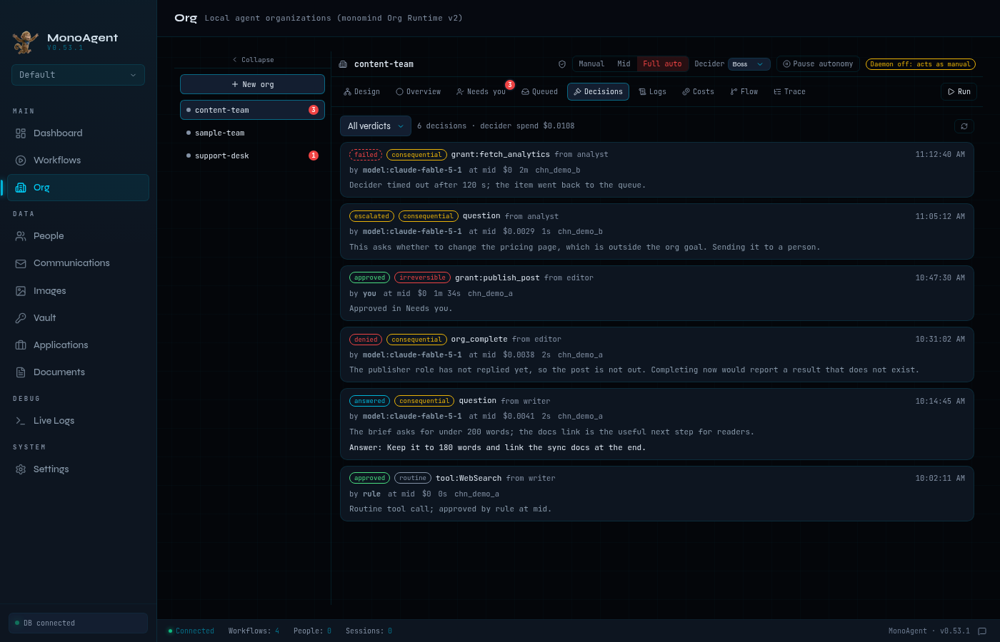

After confirming, the header shows **Full auto**. The Decisions tab lists
every routed decision, newest first: its verdict (approved, denied, answered,
escalated, failed), tier, class, who resolved it, cost, time taken, and the
decider's reason. You can filter by verdict.

### 10. Pause autonomy

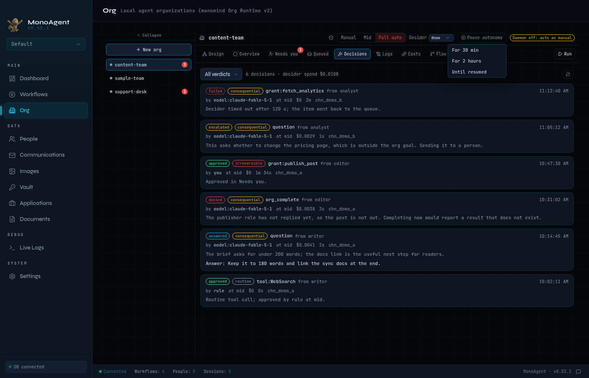

**Pause autonomy** drops the org to manual at once, for 30 minutes, 2 hours,
or until you resume it.

### 11. Paused

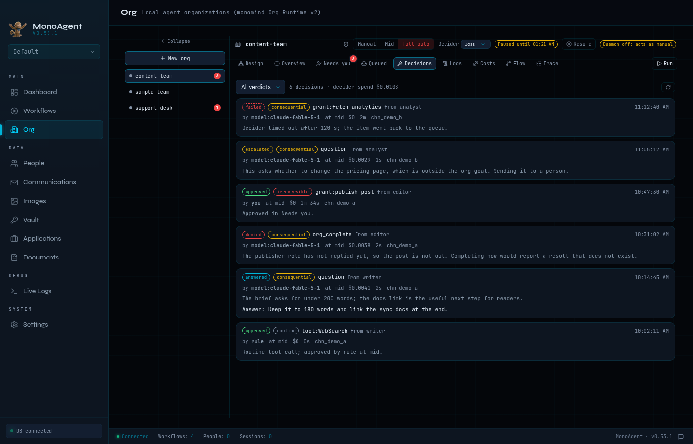

While paused, the header shows until when and offers **Resume**. The chosen
level (Full auto) is kept and comes back when the pause ends.

### 12. Queued messages

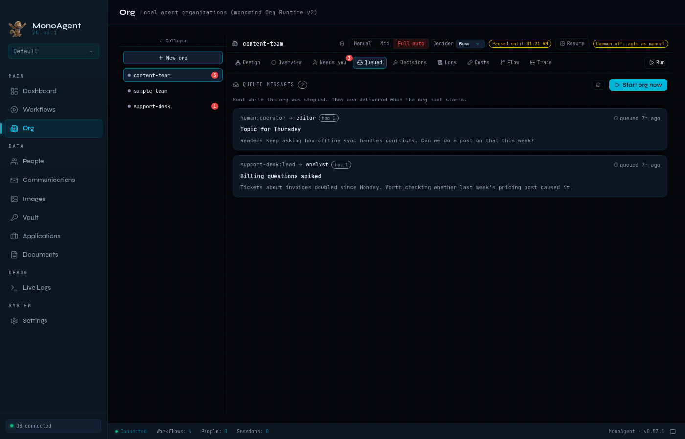

Messages sent to a stopped org wait in its queue. The Queued tab lists them
with sender, recipient role, subject, body and how long they have waited.
**Start org now** starts the org, which delivers them.

## What is real and what is seeded

All the settings in these screens were made through `monoagentcli`, and the
GUI read them back through its normal Go bindings. That covers the orgs,
workflows, automations, the automation role, the grants, the autonomy level,
the decider and the pause. The grant in screen 4, the decider change and Full
auto in screen 8, and the pause in screen 11 were done by clicking in the GUI.
The queued messages in screen 12 were sent with `monoagentcli org send` while
the org was stopped.

No org was run and no model was called, so some data that only a live run
produces was written by hand:

- **Needs you (7) and the badges (1):** the pending question, gate, and tool
  approval are hand-written `questions.json`, `gates.json` and
  `approvals.json` files in the org's monomind folder, in the format monomind
  writes during a run. `support-desk`'s badge comes from one such question.
- **Decisions feed (9):** six rows inserted into the `org_decisions` table,
  one for each verdict. During a live run the daemon writes these.
- `monoagentcli daemon` was not running. That is why the header says "Daemon
  off: acts as manual", the automation role reads "engine offline", and every
  pending item is listed under Needs you (with no daemon, nothing is decided
  automatically).
- Overview, Logs, Costs, Flow and Trace need a finished run, so they are not
  shown. `sample-team` is the example org that `monomind init` creates.

## Taking the screenshots again

The screenshots came from `wails dev`, which serves the real frontend over
HTTP with the Go bindings live. A headless Chromium opened the page and was
driven over the Chrome DevTools Protocol. Everything ran in a separate home
folder, so your own `~/.monoagent` is never touched.

1. Build the CLI and use a separate home folder for everything below:

   ```bash
   go build -o "$S/monoagentcli" ./cmd/monoagentcli   # S = any scratch dir
   export HOME=$S/home
   ```

2. Import the workflows: `examples/orgs/content-team/publish-post.json`, plus
   three small ones named "Fetch post analytics" (`http.request`), "Summarize
   reader feedback" (`core.set`) and "Weekly newsletter digest"
   (`comm.email_send`), each with `monoagentcli workflow import --file`.

3. Create the orgs and wire them up:

   ```bash
   monoagentcli org create-json content-team --json "$(cat content-team.json)"  # editor, writer, analyst
   monoagentcli org create-json support-desk --json "$(cat support-desk.json)"  # lead, agent
   monoagentcli org automation add content-team --workflow <publish id> --alias publish_post --owned
   monoagentcli org automation add content-team --workflow <analytics id> --alias fetch_analytics
   monoagentcli org automation add content-team --workflow <feedback id> --alias summarize_feedback
   monoagentcli org automation-role add content-team --alias publish_post --reports-to editor
   monoagentcli org grant add content-team --role analyst --automation fetch_analytics
   monoagentcli org grant add content-team --role analyst --automation summarize_feedback
   monoagentcli org grant add content-team --role editor --automation summarize_feedback
   monoagentcli org grant add content-team --role editor --automation publish_post --approval required
   monoagentcli org autonomy set content-team --level mid --decider model
   ```

   `content-team.json` is `examples/orgs/content-team/content-team.json` with
   an `analyst` specialist added under the editor.

4. Run `monomind init --yes --no-watch --no-install` in the profile folder
   (`$HOME/.monoagent/profiles/default`). This is what the GUI's "Initiate
   monomind on this profile" button runs.

5. Queue two messages with `monoagentcli org send content-team --to editor
   ...` and `--to analyst --from support-desk:lead ...`. Write the pending
   items to `.monomind/orgs/content-team/{questions,gates,approvals}.json`
   and `.monomind/orgs/support-desk/questions.json` in the profile folder.
   Questions need `"answer": null`, gates `"status": "pending"`, approvals
   `"approved": null`. Insert the decision rows into `org_decisions` in
   `$HOME/.monoagent/monoagent.db` (columns as in
   `data/migrations/041_org_unification.sql`).

6. Serve the GUI against that home. Keep the real Go caches, and point the
   app at the CLI you just built:

   ```bash
   cd wails-app
   # REAL_HOME = your usual home folder, so Go does not rebuild everything
   MONOAGENTCLI_BIN=$S/monoagentcli GOPATH=$REAL_HOME/go GOCACHE=$REAL_HOME/.cache/go-build \
     wails dev -m -nosyncgomod -tags webkit2_41   # the tag is needed where only webkit2gtk-4.1 is installed
   ```

   Afterwards, run `git checkout -- wails-app/frontend/package.json.md5
   wails-app/frontend/src/wailsjs` to undo the files `wails dev` regenerates.

7. Start `chromium --headless=new --remote-debugging-port=<port>
   --user-data-dir=$S/chrome`, set the viewport to 1400x900
   (`Emulation.setDeviceMetricsOverride`), open `http://localhost:34115`, and
   take each screen with `Page.captureScreenshot`. Clicks were
   `Runtime.evaluate` calls. The drag in screen 4 and the role selection in
   screen 6 used real mouse events (`Input.dispatchMouseEvent`), because the
   canvas listens for mouse down, move and up.
